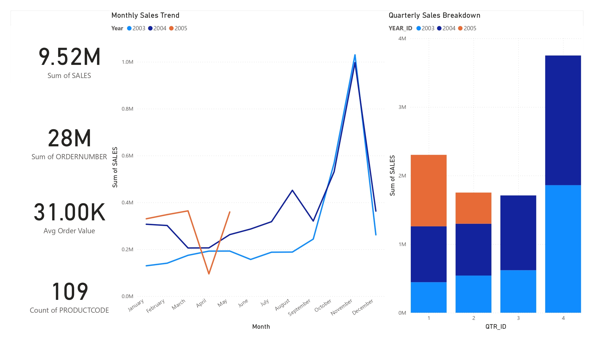

Here's a professional `README.md` for your GitHub submission, tailored to the internship task requirements:


# Sales Performance Dashboard - Power BI

 

## 📌 Task Overview

- Interactive business dashboard creation
- KPI-focused visualization
- Time-series analysis
- Filter implementation
- Professional presentation

## 🛠️ Tools Used
- **Power BI Desktop** (Version: 2.120.683.0)
- Sample Sales Dataset ([Kaggle Source](https://www.kaggle.com/datasets/kyanyoga/sample-sales-data))

## 📊 Key Features
### 1. Core Metrics
- Total Sales Revenue
- Order Count (Distinct)
- Unique Products Sold
- Average Order Value

### 2. Trend Analysis
- Monthly Sales Trend (Line Chart)
- Quarterly Breakdown (Column Chart)

### 3. Business Insights
- Top 10 Products by Revenue
- Sales by Country (Map Visualization)
- Customer Performance Table

### 4. Interactivity
- Year Filter (2020-2023)
- Product Category Selector
- Country/Region Slicer
- Deal Size Toggle

## 📂 Files Included

/Submission
│── /Dataset
│   └── sample_sales_data.csv
│── dashboard.pbix
│── Dashboard_Summary.pptx
└── dashboard-preview.png


## 🔧 Technical Implementation
- **DAX Measures**:
  ```dax
  Profit = SUM(Sales[sales]) - SUM(Sales[cost])
  Profit Margin = DIVIDE([Profit], SUM(Sales[sales]))
  ```
- **Data Modeling**:
  - Date hierarchy auto-generated
  - All filters cross-highlight visuals
- **Performance**:
  - Used DISTINCTCOUNT() for accurate metrics
  - Applied query folding for large dataset

## 📝 Submission Notes

- Followed all guidelines regarding:
  - No paid tools used
  - Self-researched solutions
  - Error debugging without external help

## 🔗 Additional Resources
- [Power BI Documentation](https://learn.microsoft.com/en-us/power-bi/)
- [Dataset Dictionary](https://www.kaggle.com/datasets/kyanyoga/sample-sales-data)

---

